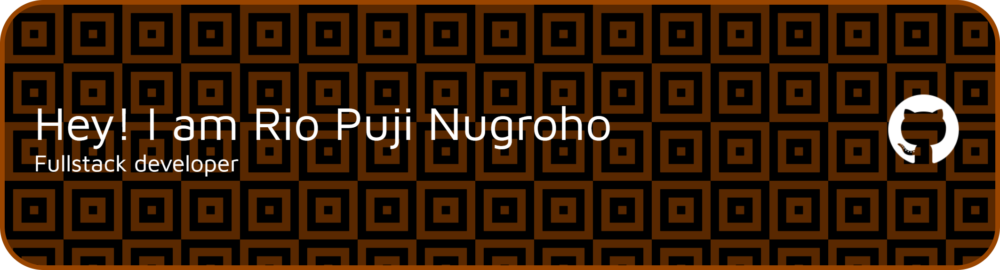

  

Full-stack developer · Building things for the web

## Experience ⚙️
I have 18 months of internship experience in IT and Travel companies.

| 🏢 Office |  Period | 📅 Years | Role/Focus |
| :--- | :--- | :--- |:---|
|PT Wisesa Consulting | January - March |  2025 |  |
|PT Virtual Data Center Indonesia (VDCI) | April - July | 2025 |  |
|PT Rahmah Travel  | August - November | 2025 |  |
|Jakarta Islamic Hospital Cempaka Putih | January - July | 2026 |  |

## Style Work ✨
 

With :  

## Tech stack </>

## Database 📊

## Website 🌐

## Contact Me 

